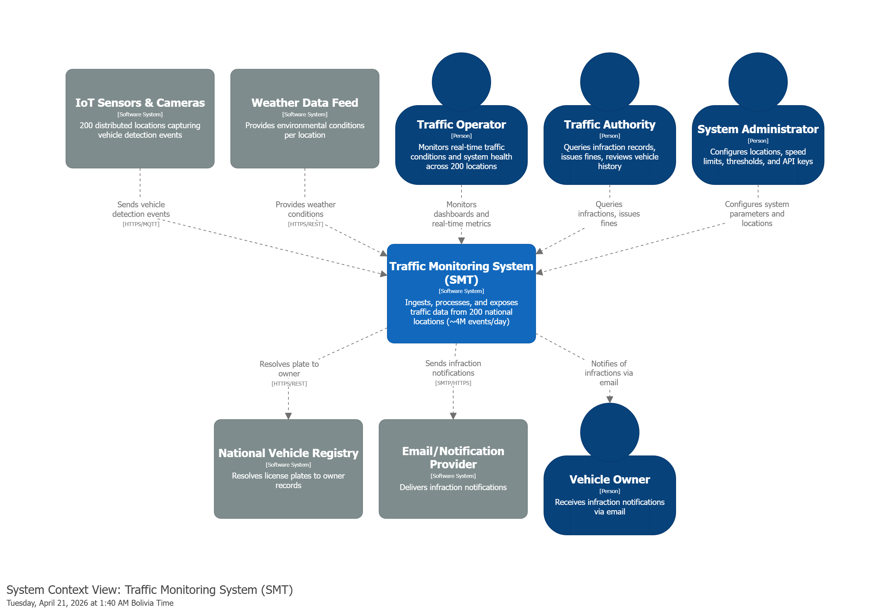
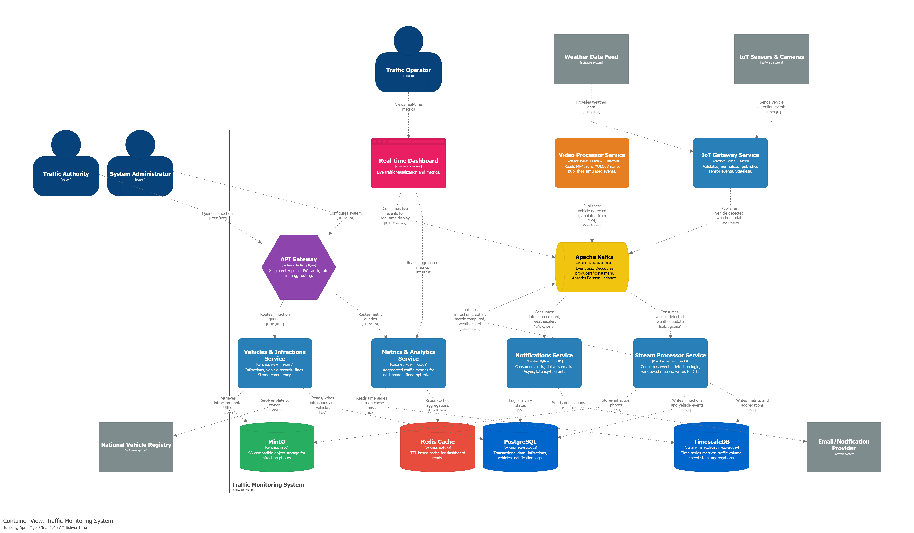
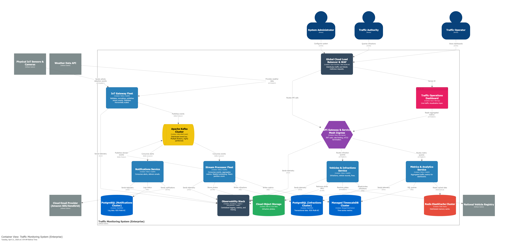

# C4 Model: Container Level (Level 2)

The SMT follows a microservices architecture designed for horizontal scalability and 12-factor compliance.

## Component Roles

- **IoT Gateway:** Acts as the entry point for telemetry. Responsible for auth, schema validation, and "Edge Computing" tasks (initial infraction flagging).
- **Kafka:** The distributed commit log that ensures zero data loss during traffic bursts.
- **Stream Processor:** The computational core. Performs metric aggregation and deep infraction analysis.
- **Metrics/Vehicles APIs:** Read-optimized services that serve the dashboard.
- **Dashboard:** Provides the human-machine interface (HMI).

## C4 MODEL

### Level 1: System Context

### Level 2: Container Diagram (Simulation)

### Level 2: Enterprise Vision

