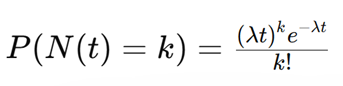
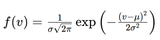
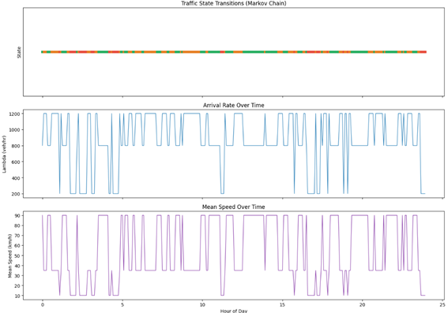
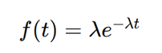

# Mathematical Models & Traffic Simulation

To achieve high-fidelity simulation, the SMT doesn't rely on random noise. It implements established probabilistic models to reflect real-world traffic behavior.

> [!NOTE]
> **Mathematical Validation:** You can explore the implementation and validation of these models in this [Google Colab Notebook](https://colab.research.google.com/drive/1rUYUwW1L5CNU7TDB4glt-dFq_Y6jubMy?usp=sharing).

## 1. Vehicle Arrivals (Poisson Distribution)
We use the Poisson distribution to model the probability of a certain number of vehicles arriving at a location in a given time interval.
- **Formula:** `P(k events in interval) = (λ^k * e^-λ) / k!`
- **Logic:** Each monitored location has a specific `λ` (arrival rate) depending on its real-world importance (e.g., Av. Cristo Redentor has a higher `λ` than Av. Heroinas).

## 2. Speed Distribution (Gaussian/Normal)
Individual vehicle speeds are modeled using a Normal distribution centered around the road's speed limit.
- **Logic:** Most vehicles stay near the limit (`μ`), with a standard deviation (`σ`) reflecting "outliers" (speeders).
- **YOLO Integration:** Real detections from video feeds are normalized using these same statistical weights.

## 3. Traffic State Transitions (Markov Chains)
Traffic doesn't just "become" congested. It transitions through states (Free Flow -> Congestion -> Incident). We use a Markov Chain to model these transitions probabilistically.

## 4. Time-to-Next-Event (Exponential Distribution)
The time between two vehicle passages is modeled using an exponential distribution, which is the continuous-time version of the Poisson process.

