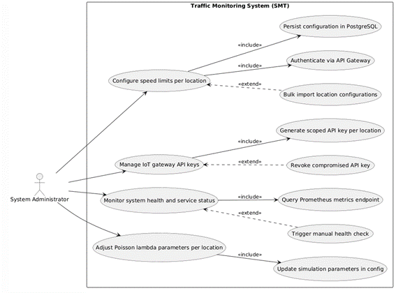
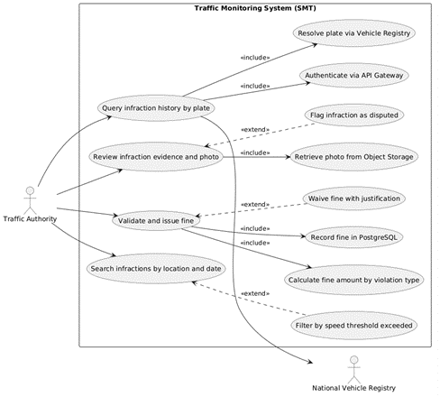
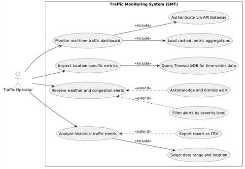
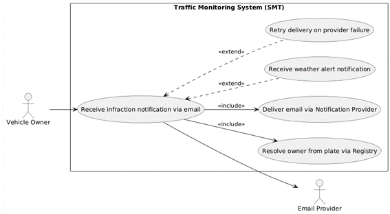
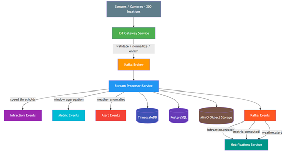
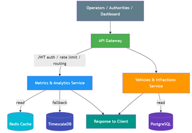

# Use Cases: Traffic Monitoring System (SMT)

The SMT is designed to handle the complex requirements of a national traffic authority. Below are the primary use cases identified for the system.

## 1. Real-Time Telemetry Ingestion
- **Actor:** IoT Sensors / Cameras
- **Description:** Thousands of remote sensors across Bolivia push vehicle passage events to the central Gateway.
- **Key Requirement:** High throughput and low latency validation.

## 2. Speed Infraction Detection
- **Actor:** Stream Processor
- **Description:** Automatically identifies vehicles exceeding the speed limit based on location-specific thresholds.
- **Key Requirement:** Immediate processing and reliable alerting.

## 3. Real-Time Analytics Dashboard
- **Actor:** Traffic Operator
- **Description:** Visualizes live traffic flow, average speeds, and current weather conditions per city (Santa Cruz, La Paz, Cochabamba).
- **Key Requirement:** Real-time visualization without UI blocking.

## 4. Vehicle Trajectory Forensics
- **Actor:** Law Enforcement / Admin
- **Description:** Queries the historical path of a specific license plate over a given time interval.
- **Key Requirement:** Efficient time-series indexing.

## 5. System Health Monitoring (NOC)
- **Actor:** Infrastructure Engineer
- **Description:** Monitors the "Golden Signals" of the system (Latency, Traffic, Errors, Saturation) through Prometheus-style metrics.

### Use Case Actors

| Actor | Responsibility | Diagram |
| :--- | :--- | :--- |
| **System Admin** | Infrastructure & Deployment |  |
| **Traffic Authority** | Law Enforcement & Infractions |  |
| **Traffic Operator** | Live Monitoring & NOC |  |
| **Vehicle Owner** | Alert Recipient |  |

### Visual Flows

#### Ingestion Flow (Sensors to Broker)

#### Query Flow (Dashboard to Services)

